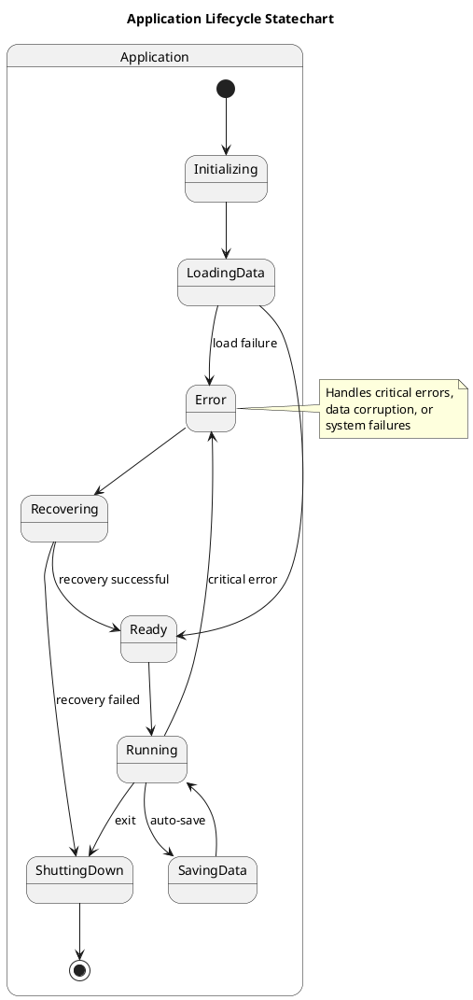
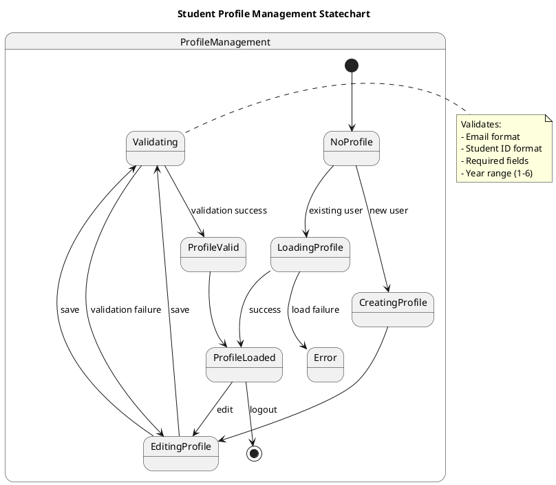
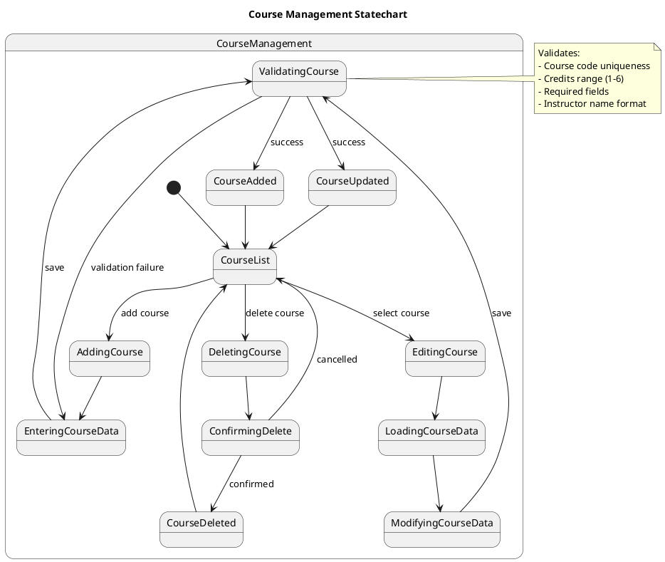
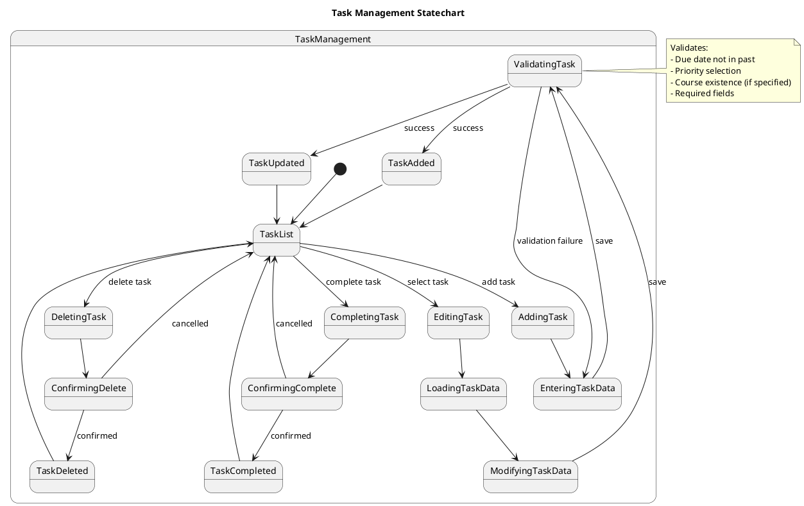
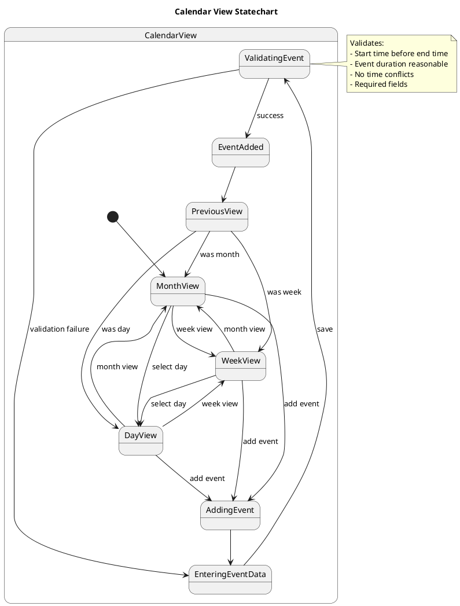
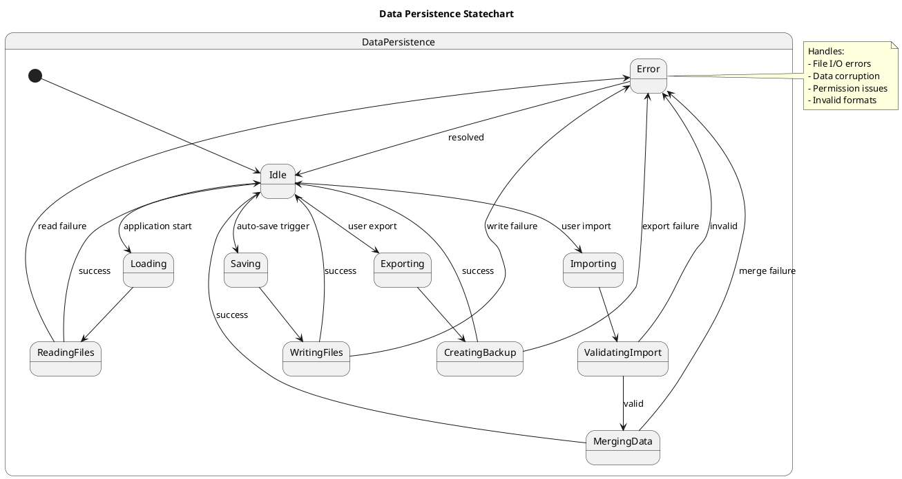
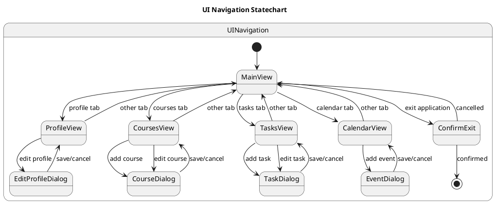
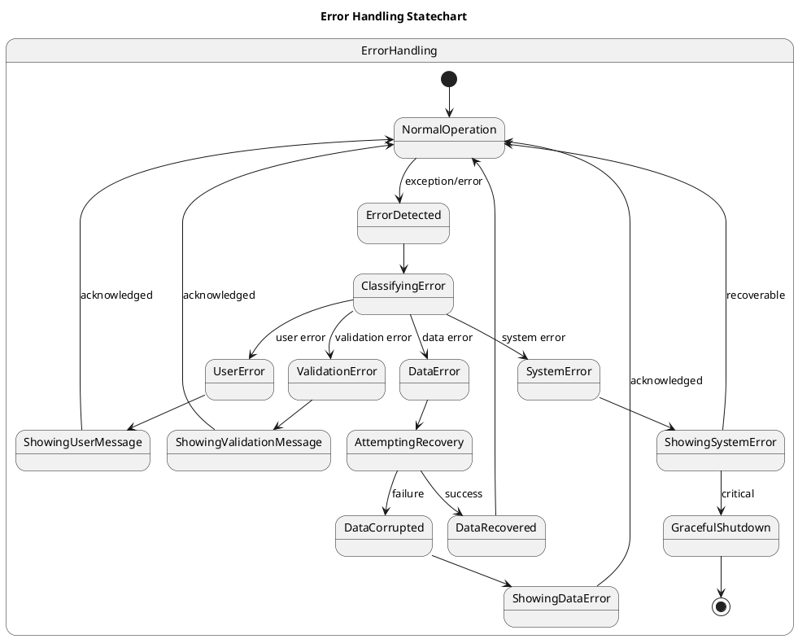

# System Statechart Diagrams

## Overview
This document contains statechart diagrams that describe the dynamic behavior of the Student Planner application's key components and user interactions.

## 1. Application Lifecycle Statechart

### Application States

### State Descriptions
- **Initializing**: Application startup, loading configuration
- **LoadingData**: Loading user data from CSV files
- **Ready**: Application ready for user interaction
- **Running**: Normal operation mode
- **SavingData**: Auto-saving data to files
- **Error**: Error state for critical failures
- **Recovering**: Attempting to recover from errors
- **ShuttingDown**: Application shutdown process

---

## 2. Student Profile Management Statechart

### Profile States

### State Descriptions
- **NoProfile**: No student profile exists
- **CreatingProfile**: User entering new profile data
- **LoadingProfile**: Loading existing profile from storage
- **EditingProfile**: Modifying profile information
- **Validating**: Validating profile data
- **ProfileValid**: Profile data validated successfully
- **ProfileLoaded**: Profile ready for use
- **Error**: Error loading or saving profile

---

## 3. Course Management Statechart

### Course Management States

### State Descriptions
- **CourseList**: Displaying list of courses
- **AddingCourse**: Initiating course creation
- **EnteringCourseData**: User inputting course details
- **ValidatingCourse**: Validating course data
- **CourseAdded**: Course successfully added
- **EditingCourse**: Initiating course edit
- **LoadingCourseData**: Loading existing course data
- **ModifyingCourseData**: User modifying course details
- **CourseUpdated**: Course successfully updated
- **DeletingCourse**: Initiating course deletion
- **ConfirmingDelete**: Waiting for user confirmation
- **CourseDeleted**: Course successfully deleted

---

## 4. Task Management Statechart

### Task Management States

### State Descriptions
- **TaskList**: Displaying list of tasks
- **AddingTask**: Initiating task creation
- **EnteringTaskData**: User inputting task details
- **ValidatingTask**: Validating task data
- **TaskAdded**: Task successfully added
- **EditingTask**: Initiating task edit
- **LoadingTaskData**: Loading existing task data
- **ModifyingTaskData**: User modifying task details
- **TaskUpdated**: Task successfully updated
- **CompletingTask**: Initiating task completion
- **ConfirmingComplete**: Waiting for user confirmation
- **TaskCompleted**: Task marked as complete
- **DeletingTask**: Initiating task deletion
- **ConfirmingDelete**: Waiting for user confirmation
- **TaskDeleted**: Task successfully deleted

---

## 5. Calendar View Statechart

### Calendar View States

### State Descriptions
- **MonthView**: Monthly calendar view
- **WeekView**: Weekly timeline view
- **DayView**: Daily hourly view
- **AddingEvent**: Initiating event creation
- **EnteringEventData**: User inputting event details
- **ValidatingEvent**: Validating event data
- **EventAdded**: Event successfully added
- **PreviousView**: Remembering previous view state

---

## 6. Data Persistence Statechart

### Data Persistence States

### State Descriptions
- **Idle**: No active persistence operations
- **Saving**: Auto-saving data to files
- **Loading**: Loading data from files
- **Exporting**: Creating data backup
- **Importing**: Restoring from backup
- **WritingFiles**: Writing data to CSV files
- **ReadingFiles**: Reading data from CSV files
- **CreatingBackup**: Creating export file
- **ValidatingImport**: Validating import data
- **MergingData**: Merging imported data
- **Error**: Persistence operation failed

---

## 7. User Interface Navigation Statechart

### UI Navigation States

### State Descriptions
- **MainView**: Main application window
- **ProfileView**: Student profile tab
- **CoursesView**: Course management tab
- **TasksView**: Task management tab
- **CalendarView**: Calendar view tab
- **EditProfileDialog**: Profile editing dialog
- **CourseDialog**: Course creation/editing dialog
- **TaskDialog**: Task creation/editing dialog
- **EventDialog**: Event creation/editing dialog
- **ConfirmExit**: Application exit confirmation

---

## 8. Error Handling Statechart

### Error Handling States

### State Descriptions
- **NormalOperation**: System running normally
- **ErrorDetected**: Error or exception occurred
- **ClassifyingError**: Determining error type
- **ValidationError**: Input validation failed
- **DataError**: Data persistence error
- **SystemError**: Critical system error
- **UserError**: User operation error
- **ShowingValidationMessage**: Displaying validation error
- **ShowingUserMessage**: Displaying user error
- **ShowingSystemError**: Displaying system error
- **ShowingDataError**: Displaying data error
- **AttemptingRecovery**: Trying to recover data
- **DataRecovered**: Recovery successful
- **DataCorrupted**: Recovery failed
- **GracefulShutdown**: Safe application shutdown

---

## Implementation Notes

### State Machine Implementation
The statecharts are implemented using:
- **State Pattern**: Each major component uses state objects
- **Event-Driven Architecture**: State transitions triggered by events
- **Observer Pattern**: UI components observe state changes
- **Command Pattern**: User actions encapsulated as commands

### State Persistence
- Application state saved on each transition
- Recovery mechanisms for critical states
- State history for undo/redo operations
- Error state logging for debugging

### Testing Strategy
- Unit tests for each state transition
- Integration tests for state machine interactions
- UI tests for state visualization
- Error injection tests for robustness

### Performance Considerations
- State transitions optimized for minimal overhead
- Lazy loading of state data
- Caching of frequently accessed states
- Asynchronous state operations where appropriate

These statecharts provide a comprehensive view of the Student Planner application's dynamic behavior and serve as a foundation for both implementation and testing.
