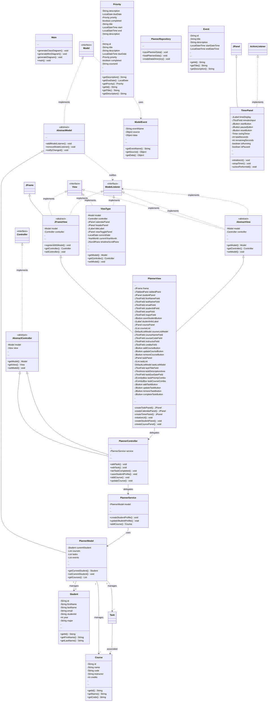

```mermaid
classDiagram
    title Student Planner - Class Diagram

    %% Package: util
    class Main
    class Main {
        +generateClassDiagram() void
        +generateMvcDiagram() void
        -generateDiagram() void
        ...
    }

    %% Package: mvc
    class ModelListener<<interface>>
    class AbstractModel<<abstract>>
    class AbstractModel {
        +addModelListener() void
        +removeModelListener() void
        +notifyChanged() void
        ...
    }
    class AbstractController<<abstract>>
    class AbstractController {
        -Model model
        -View view
        ..
        +getModel() Model
        +getView() View
        +setModel() void
        ...
    }
    class JFrameView<<abstract>>
    class JFrameView {
        -Model model
        -Controller controller
        ..
        +registerWithModel() void
        +getController() Controller
        +setController() void
        ...
    }
    class ModelEvent
    class ModelEvent {
        -String eventName
        -Object source
        -Object data
        ..
        +getEventName() String
        +getSource() Object
        +getData() Object
        ...
    }
    class AbstractView<<abstract>>
    class AbstractView {
        -Model model
        -Controller controller
        ..
        +getModel() Model
        +getController() Controller
        +setModel() void
        ...
    }
    class Controller<<interface>>
    class View<<interface>>
    class Model<<interface>>

    %% Package: planner
    class PlannerView
    class PlannerView {
        -createTodoPanel() JPanel
        -createCalendarPanel() JPanel
        -createTimerPanel() JPanel
        ...
    }
    class Priority
    class Priority {
        -String description
        -LocalDate dueDate
        -Priority priority
        -boolean completed
        -String title
        -LocalDateTime start
        -LocalDateTime end
        -String description
        ..
        +getDescription() String
        +getDueDate() LocalDate
        +getPriority() Priority
        ...
    }
    class PlannerController
    class PlannerController {
        +addTask() void
        +editTask() void
        +setTaskCompleted() void
        ...
    }
    class Main
    class Main {
        +main() void
    }

    %% Package: planner.ui
    class PlannerView
    class PlannerView {
        -JFrame frame
        -JTabbedPane tabbedPane
        -JPanel studentPanel
        -JTextField firstNameField
        -JTextField lastNameField
        -JTextField emailField
        -JTextField studentIdField
        -JTextField yearField
        -JTextField majorField
        -JButton saveStudentButton
        -JLabel studentInfoLabel
        -JPanel coursePanel
        -JList<Course> courseList
        -DefaultListModel<Course> courseListModel
        -JTextField courseNameField
        -JTextField courseCodeField
        -JTextField instructorField
        -JTextField creditsField
        -JButton addCourseButton
        -JButton updateCourseButton
        -JButton removeCourseButton
        -JPanel taskPanel
        -JList<Task> taskList
        -DefaultListModel<Task> taskListModel
        -JTextField taskTitleField
        -JTextArea taskDescriptionArea
        -JTextField taskDueDateField
        -JComboBox<Task.Priority> taskPriorityCombo
        -JComboBox<String> taskCourseCombo
        -JButton addTaskButton
        -JButton updateTaskButton
        -JButton removeTaskButton
        -JButton completeTaskButton
        ..
        -initializeUI() void
        -createStudentPanel() void
        -createCoursePanel() void
        ...
    }
    class PlannerController
    class PlannerController {
        -PlannerService service
        ..
        +saveStudentProfile() void
        +addCourse() void
        +updateCourse() void
        ...
    }

    %% Package: planner.ui.calendar
    class ViewType
    class ViewType {
        -Model model
        -Controller controller
        -JPanel calendarPanel
        -JPanel headerPanel
        -JLabel titleLabel
        -JPanel viewTogglePanel
        -LocalDate currentDate
        -YearMonth currentYearMonth
        -JScrollPane timelineScrollPane
        ..
        +getModel() Model
        +getController() Controller
        +setModel() void
        ...
    }

    %% Package: planner.ui.timer
    class TimerPanel
    class TimerPanel {
        -JLabel timeDisplay
        -JTextField minutesInput
        -JButton startButton
        -JButton pauseButton
        -JButton resetButton
        -Timer swingTimer
        -int totalSeconds
        -int remainingSeconds
        -boolean isRunning
        -boolean isPaused
        ..
        -initializeUI() void
        -setupTimer() void
        +actionPerformed() void
        ...
    }

    %% Package: planner.persistence
    class PlannerRepository
    class PlannerRepository {
        +savePlannerData() void
        +loadPlannerData() void
        -createDataDirectory() void
        ...
    }

    %% Package: planner.model
    class PlannerModel
    class PlannerModel {
        -Student currentStudent
        -List<Course> courses
        -List<Task> tasks
        -List<Event> events
        ..
        +getCurrentStudent() Student
        +setCurrentStudent() void
        +getCourses() List<Course>
        ...
    }
    class Event
    class Event {
        -String id
        -String title
        -String description
        -LocalDateTime startDateTime
        -LocalDateTime endDateTime
        ..
        +getId() String
        +getTitle() String
        +getDescription() String
        ...
    }
    class Course
    class Course {
        -String id
        -String name
        -String code
        -String instructor
        -int credits
        ..
        +getId() String
        +getName() String
        +getCode() String
        ...
    }
    class Priority
    class Priority {
        -String id
        -String title
        -String description
        -LocalDateTime dueDate
        -Priority priority
        -boolean completed
        -String courseId
        ..
        +getId() String
        +getTitle() String
        +getDescription() String
        ...
    }
    class Student
    class Student {
        -String id
        -String firstName
        -String lastName
        -String email
        -String studentId
        -int year
        -String major
        ..
        +getId() String
        +getFirstName() String
        +getLastName() String
        ...
    }

    %% Package: planner.service
    class PlannerService
    class PlannerService {
        -PlannerModel model
        ..
        +createStudentProfile() void
        +updateStudentProfile() void
        +addCourse() Course
        ...
    }

    %% Inheritance
    Model <|.. AbstractModel : implements
    Controller <|.. AbstractController : implements
    JFrame <|-- JFrameView
    View <|.. JFrameView : implements
    ModelListener <|.. JFrameView : implements
    View <|.. AbstractView : implements
    ModelListener <|.. AbstractView : implements
    JFrameView <|-- PlannerView
    AbstractController <|-- PlannerController
    AbstractView <|-- PlannerView
    AbstractController <|-- PlannerController
    View <|.. ViewType : implements
    ModelListener <|.. ViewType : implements
    JPanel <|-- TimerPanel
    ActionListener <|.. TimerPanel : implements
    AbstractModel <|-- PlannerModel

    %% MVC Relationships
    Model ..> ModelEvent : uses
    AbstractModel ..> ModelListener : notifies
    AbstractView ..> ModelListener : implements
    PlannerService --> PlannerModel : uses
    PlannerController --> PlannerService : delegates
    PlannerView --> PlannerController : delegates

    %% Domain Relationships
    PlannerModel "1" --> "1" Student : manages
    PlannerModel "1" --> "*" Course : manages
    PlannerModel "1" --> "*" Task : manages
    Task --> Course : associated
```
