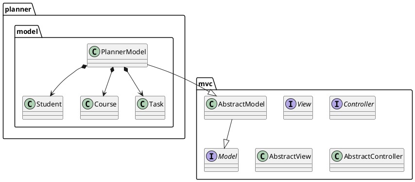
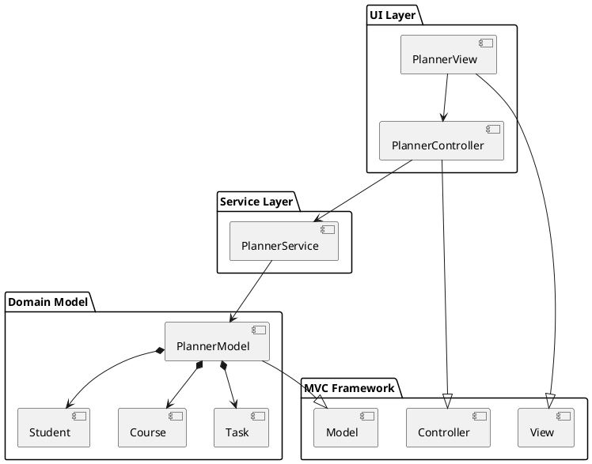

# PROMPT J: DIAGRAM GENERATION SCRIPTS

## **MANDATORY**: Create scripts that automatically generate class and architecture diagrams.

## Module of Thought

**Phase**: Documentation Automation  
**Purpose**: Auto-generate visual documentation from code  
**Dependencies**: PROMPT-I (Documentation)

### Why Auto-Generate Diagrams?

**Problem**: Manual diagram creation is:
- Time-consuming
- Error-prone
- Becomes outdated quickly

**Solution**: Parse Java code and generate diagrams automatically

### Diagram Types to Generate

1. **Class Diagram**: Shows all classes, fields, methods, and relationships
2. **MVC Architecture Diagram**: Shows layers and component interactions
3. **Sequence Diagram**: Shows MVC flow for "Add Task" operation
4. **Mermaid Class Diagram**: Markdown-compatible version for GitHub

### Script Architecture

```
generate_diagrams.py
├── Phase 1: Scan Java files
├── Phase 2: Parse classes (extract: name, fields, methods, inheritance)
├── Phase 3: Generate PlantUML
│   ├── class-diagram.puml
│   ├── mvc-diagram.puml
│   └── sequence-diagram.puml
├── Phase 4: Generate Mermaid
│   └── class-diagram.md
└── Phase 5: (Optional) Generate PNG
    └── Try multiple methods
```

### Java Parsing Strategy

**Regex-based parsing** (simplified approach):
```python
# Package
codePattern = r'^package\s+([\w.]+);'

# Class/Interface
classPattern = r'^(public\s+)?(abstract\s+)?(class|interface|enum)\s+(\w+)'

# Fields
fieldPattern = r'^(private|protected|public)\s+(?:static\s+)?(?:final\s+)?(\w+)\s+(\w+)\s*;'

# Methods
methodPattern = r'^(public|private|protected)\s+(?:static\s+)?(?:abstract\s+)?(\w+)\s+(\w+)\s*\('
```

**Limitations**: 
- Regex parsing is imperfect (no AST)
- Works for well-formatted code
- Sufficient for documentation purposes

### PlantUML Generation

**Class Diagram Format**:


### MVC Architecture Diagram

**Component Diagram**:


### PNG Generation Methods

**Method 1: PlantUML Server Encoding**
- Compress PlantUML text with deflate
- Encode with PlantUML's custom base64 variant
- Send GET request to plantuml.com/plantuml/png/{encoded}

**Method 2: PlantUML Text API**
- POST PlantUML text to server
- Receive PNG response

**Method 3: Local Java**
- Check for plantuml.jar in common locations
- Execute: java -jar plantuml.jar -tpng input.puml

**Fallback Strategy**: Try methods in order, continue if one fails

### Expected Outcome

After this prompt, you should have:
- Python script that parses Java files
- Generates 3 PlantUML diagrams (.puml)
- Generates 1 Mermaid diagram (.md)
- Attempts to generate PNG files (multiple methods)
- Creates README explaining how to view diagrams
- Shell script for easy PNG generation

### Verification Halt

**Check before completing**:

- [ ] Script scans src/main/java recursively
- [ ] Parses class names, fields, methods
- [ ] Extracts inheritance relationships
- [ ] Generates valid PlantUML syntax
- [ ] Creates class-diagram.puml
- [ ] Creates mvc-diagram.puml
- [ ] Creates sequence-diagram.puml
- [ ] Creates class-diagram.md (Mermaid)
- [ ] Attempts PNG generation
- [ ] Documentation explains viewing options

**Test the Script**:
```bash
python3 generate_diagrams.py

# Should output:
# 🔍 Scanning Java files...
# 📁 Found 17 Java files
# 🔍 Parsing classes...
# 📊 Parsed 17 classes
# 🎨 Generating class diagram (PlantUML)...
# ✅ Class diagram saved to: diagrams/class-diagram.puml
# ...
```

### Usage Instructions for Users

**Viewing PlantUML Online**:
1. Go to https://www.plantuml.com/plantuml/
2. Copy .puml file contents
3. Paste into editor
4. Download PNG or view online

**VS Code Extension**:
1. Install "PlantUML" extension
2. Open .puml file
3. Press Alt+D (or Option+D on Mac)
4. Preview appears

**Shell Script**:
```bash
./generate_png.sh
# Auto-downloads PlantUML if needed
# Generates PNG files
```

---

**Next**: PROMPT-INDEX (Summary of all prompts)  
**Prev**: PROMPT-I: Documentation and Project Completion
